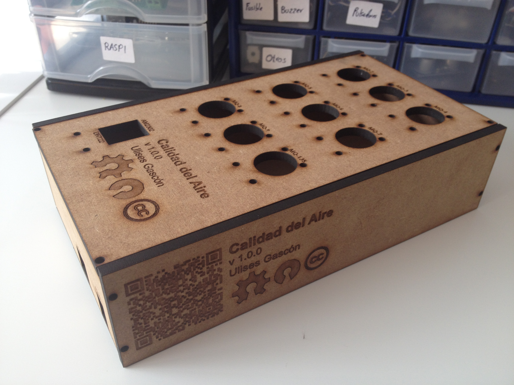
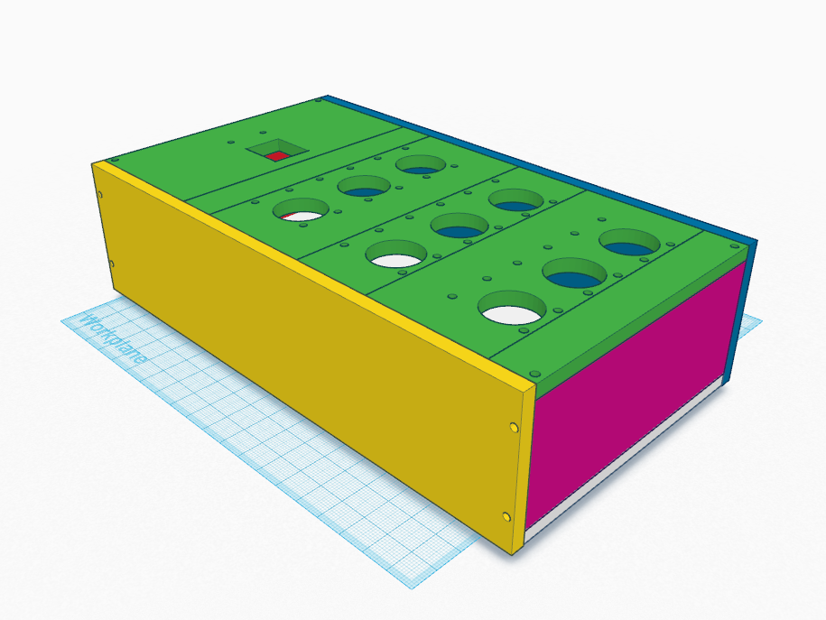
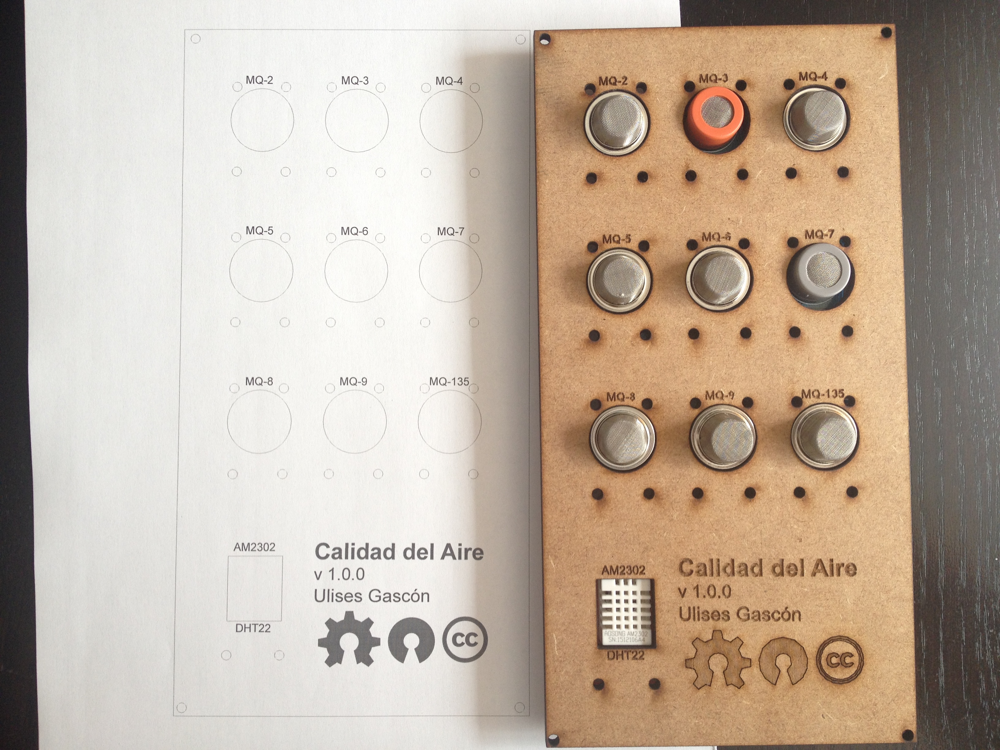
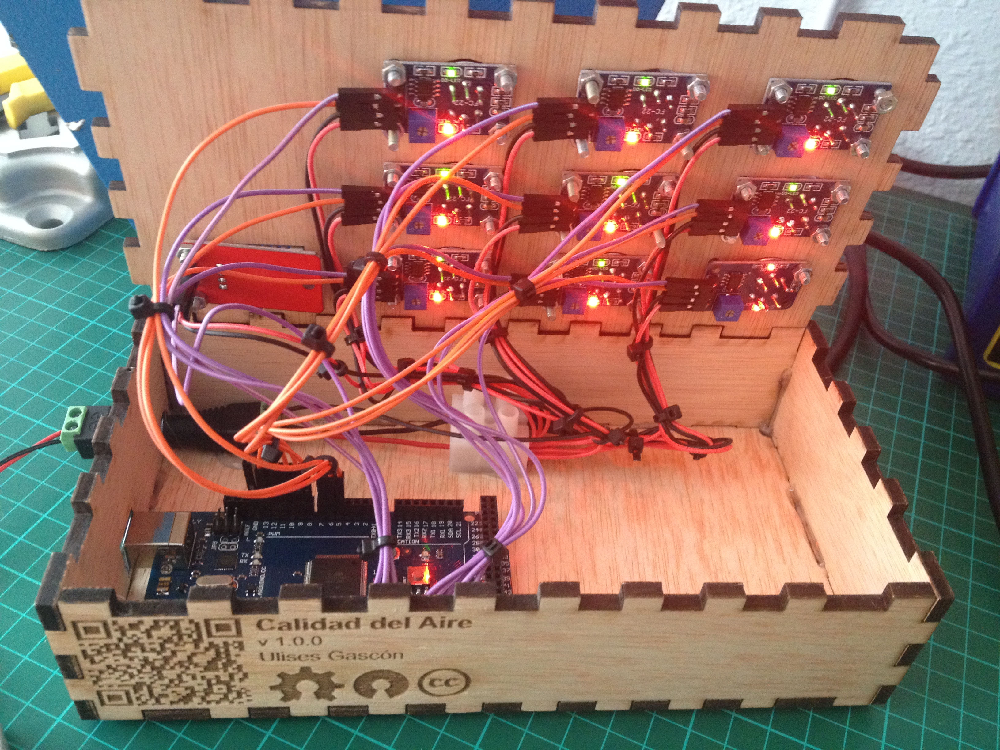
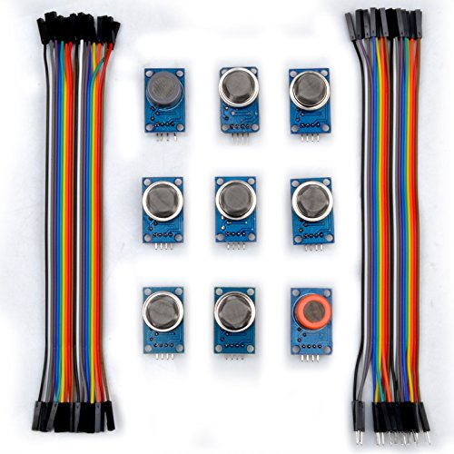
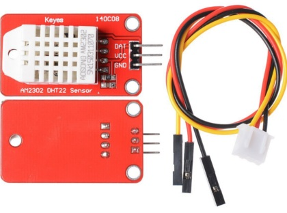

# Calidad-del-Aire
Sistema para controlar la calidad del aire usando Arduino y los sensores MQ(2-9, y 135), AM2302 y DHT22. Los datos se exportan en formato .json vía comunicación serial

### Contenedor (caja)



**Diseño impresión 3D**



- [Formato .STL](caja/caja_design.png)
- [Formato .OBJ](caja/caja_design.png)

**Diseño Corte Laser**



- [Formato .DXF](caja/caja_design.dxf)
- [Formato .SVG](caja/caja_design.svg)
- [Formato .PNG](caja/caja_design.png)
- [Formato .PDF](caja/caja_design.pdf)


### Conexiones



**Alimentación**

- Alimentación externa (5v - 3A). Todos los sensores se conectan a la alimentación externa.

- GND del Arduino y GND de la fuente externa se conectan entre sí.

- IMPORTANTE: 5v (fuente de alimentación) y 5v (Arduino) NO se conectan entre sí.

**Analógicas**

- MQ-2 -> A13
- MQ-3 -> A12
- MQ-4 -> A11
- MQ-5 -> A10
- MQ-6 -> A9
- MQ-7 -> A8
- MQ-8 -> A7
- MQ-9 -> A6
- MQ-135 -> A5

**Digitales**

- MQ-2 -> 13
- MQ-3 -> 12
- MQ-4 -> 11
- MQ-5 -> 10
- MQ-6 -> 9
- MQ-7 -> 8
- MQ-8 -> 7
- MQ-9 -> 6
- MQ-135 -> 5
- AM2302/DHT22 -> 4


### Datos (formato [JSON](https://www.wikiwand.com/es/JSON))

Ejemplo de los datos que esperamos recibir vía puerto serial

```json
{
	"humedad": {
		"valido": true,
		"valor": 0,
		"sensor": "AM2302",
		"unidad": "%"
	},
	"temperatura": {
		"valido": true,
		"valor": 0,
		"sensor": "DHT22",
		"unidad": "°C"
	},
	"glp": {
		"valido": true,
		"valor": 0,
		"unidad": "ppm",
		"descripcion": "Gas licuado del petróleo (Propano, Butano, ambos)",
		"formulaQuimica": ["C3H8", "C4H10"],
		"umbralAlcanzado": false,
		"voltaje": 0,
		"resistencia": 0,
		"valorAnalogico": 0,
		"sensor": "MQ-2"
	},
	"alcohol": {
		"valido": true,
		"valor": 0,
		"unidad": "ppm",
		"descripcion": "Alcohol (Benceno, Propano, Etanol, Metanol)",
		"formulaQuimica": ["C6H6", "C3H8", "C2H6O", "CH3OH"],
		"umbralAlcanzado": false,
		"voltaje": 0,
		"resistencia": 0,
		"valorAnalogico": 0,
		"sensor": "MQ-3"
	},
	"metano": {
		"valido": true,
		"valor": 0,
		"unidad": "ppm",
		"descripcion": "Gas natural, Metano",
		"formulaQuimica": ["CH4"],
		"umbralAlcanzado": false,
		"voltaje": 0,
		"resistencia": 0,
		"valorAnalogico": 0,
		"sensor": "MQ-4"
	},
	"metano": {
		"valido": true,
		"valor": 0,
		"unidad": "ppm",
		"descripcion": "Propano",
		"formulaQuimica": ["C3H8"],
		"umbralAlcanzado": false,
		"voltaje": 0,
		"resistencia": 0,
		"valorAnalogico": 0,
		"sensor": "MQ-6"
	},
	"monoxidoDeCarbono": {
		"valido": true,
		"valor": 0,
		"unidad": "ppm",
		"descripcion": "Monóxido de Carbono",
		"formulaQuimica": ["CO"],
		"umbralAlcanzado": false,
		"voltaje": 0,
		"resistencia": 0,
		"valorAnalogico": 0,
		"sensor": "MQ-7"
	},
	"hidrogeno": {
		"valido": true,
		"valor": 0,
		"unidad": "ppm",
		"descripcion": "Hidrógeno",
		"formulaQuimica": ["H2"],
		"umbralAlcanzado": false,
		"voltaje": 0,
		"resistencia": 0,
		"valorAnalogico": 0,
		"sensor": "MQ-8"
	},
	"amoniaco": {
		"valido": true,
		"valor": 0,
		"unidad": "ppm",
		"descripcion": "Amoníaco",
		"formulaQuimica": ["NH3"],
		"umbralAlcanzado": false,
		"voltaje": 0,
		"resistencia": 0,
		"valorAnalogico": 0,
		"sensor": "MQ-135"
	},
	"dioxidoDeCarbono": {
		"valido": true,
		"valor": 0,
		"unidad": "ppm",
		"descripcion": "Dióxido de carbono",
		"formulaQuimica": ["CO2"],
		"umbralAlcanzado": false,
		"voltaje": 0,
		"resistencia": 0,
		"valorAnalogico": 0,
		"sensor": "MQ-135"
	},
	"oxidosDeNitrogeno": {
		"valido": true,
		"valor": 0,
		"unidad": "ppm",
		"descripcion": "Óxidos de nitrógeno (Óxido nitroso, Óxido nítrico, Anhídrido nitroso, Tetraóxido de nitrógeno, Peróxido nítrico
, Anhídrido nítrico)",
		"formulaQuimica": ["NOx", "N2O", "NO", "N2O3", "N2O4", "NO2", "N2O5"],
		"umbralAlcanzado": false,
		"voltaje": 0,
		"resistencia": 0,
		"valorAnalogico": 0,
		"sensor": "MQ-135"
	}
}
```

### Librerías

- [DHTMaster](https://github.com/markruys/arduino-DHT)

### Datasheets

- [MQ-2](datasheets/MQ-2_datasheet.pdf)
- [MQ-3](datasheets/MQ-3_datasheet.pdf)
- [MQ-4](datasheets/MQ-4_datasheet.pdf)
- [MQ-5](datasheets/MQ-5_datasheet.pdf)
- [MQ-6](datasheets/MQ-6_datasheet.pdf)
- [MQ-7](datasheets/MQ-7_datasheet.pdf)
- [MQ-8](datasheets/MQ-8_datasheet.pdf)
- [MQ-9](datasheets/MQ-9_datasheet.pdf)
- [MQ-135](datasheets/MQ-135_datasheet.pdf)
- [DHT22 y AM2302](datasheets/DHT22_datasheet.pdf)

### Sensores

- **Gases**



- [Sensor Kit (MQ2, MQ3, MQ4, MQ5, MQ6, MQ7, MQ8, MQ9 y MQ135) con jumpers](https://www.amazon.es/gp/product/B019GK4RNK)

- **Humedad y temperatura**



- [XCSOURCE® Módulo Sensor Digital Humedad DHT22 y Temperatura AM2302 Para Arduino TE248](https://www.amazon.es/gp/product/B011U8GA40/)
