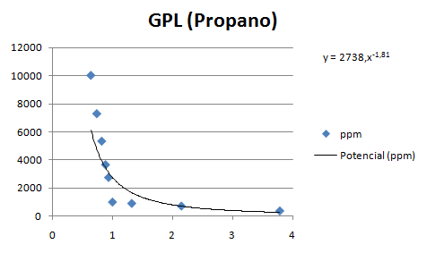
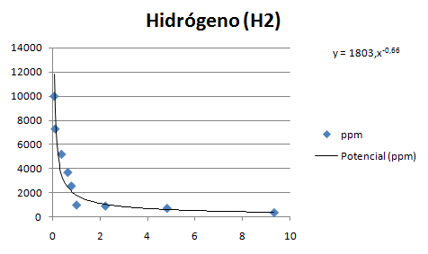
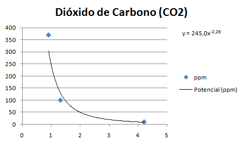
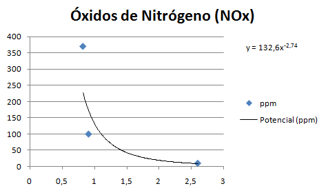
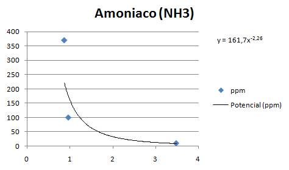

# Cálculos

Estos son los calculos que se utilizan en el sketch para convertir los valores analógicos de los sensores.


### Alcohol


**Puntos de la curva**

Rs/Ro | mg/L
------------ | -------------
0,16 | 10
0,209 | 9,156
0,294 | 8,03
0,355 | 6,343
0,489 | 4,656
0,635 | 2,828
0,744 | 1,14
1 | 0,648
2,7 | 0,416
4,162 | 0,114


**Ecuación potencial**

- Expresión:
```
	y = 1,108x-1,41  
```
- Código:
```arduino
	double Alcohol = 1,108*pow(mq3_resistencia/5463, -1,41);
```


### Gases Licuados del Petróleo (GLP)


**Puntos de la curva**

Rs/Ro | ppm
------------ | -------------
0,992 | 10000
1,01 | 9000
1,064 | 7142,85
1,1 | 6142,85
2,1 | 2928,57
2,766 | 1000
4 | 878,57
5 | 585,71
5,666 | 371,42


**Ecuación potencial**

- Expresión:
```
	y = 8555,x-1,74
```
- Código:
```arduino
	double glp = 8555*pow(mq2_resistencia/5463, -1,74);
```


### Metano


**Puntos de la curva**

Rs/Ro | ppm
------------ | -------------
0,898 | 10000
0,915 | 7279,069
2,583 | 1000
4,75 | 379,069


**Ecuación potencial**

- Expresión:
```
	y = 6922,x-1,91
```
- Código:
```arduino
	double metano = 6922*pow(mq4_resistencia/5463, -1,91);
```

### Propano




**Puntos de la curva**

Rs/Ro | ppm
------------ | -------------
0,64 | 10000
0,738 | 7279,069
0,82 | 5325,581
0,885 | 3651,162
0,934 | 2744,186
1 | 1000
1,32 | 903,076
2,145 | 716,153
3,781 | 370


**Ecuación potencial**

- Expresión:
```
	y = 2738,x-1,81 
```
- Código:
```arduino
	double propano = 2738*pow(mq6_resistencia/5463, -1,81);
```


### Monóxido de Carbono


**Puntos de la curva**

Rs/Ro | ppm
------------ | -------------
0,096 | 6464,285
0,405 | 1000
0,614 | 640
1 | 100
2,894 | 73,214


**Ecuación potencial**

- Expresión:
```
	y = 233,9x-1,40 
```
- Código:
```arduino
	double monoxidoDeCarbono = 233,9*pow(mq7_resistencia/5463, -1,40);
```
  

### Hidrógeno



**Puntos de la curva**

Rs/Ro | ppm
------------ | -------------
0,059 | 10000
0,1 | 7300
0,366 | 5200
0,633 | 3700
0,783 | 2575
1 | 1000
2,211 | 917,5
4,807 | 730
9,307 | 370


**Ecuación potencial**

- Expresión:
```
	y = 1803,x-0,66 
```
- Código:
```arduino
	double hidrogeno = 1803*pow(mq8_resistencia/5463, -0.66);
```
  

### Dióxido de Carbono



**Puntos de la curva**

Rs/Ro | ppm
------------ | -------------
0,911 | 370
1,321 | 100
4,214 | 10


**Ecuación potencial**

- Expresión:
```
	y = 245,0x-2,26
```
- Código:
```arduino
	double dioxidoDeCarbono = 245*pow(mq135_resistencia/5463, -2.26);
```
  

### Óxidos de Nitrógeno



**Puntos de la curva**

Rs/Ro | ppm
------------ | -------------
0,823 | 370
0,911 | 100
2,607 | 10


**Ecuación potencial**

- Expresión:
```
	y = 132,6x-2,74 
```
- Código:
```arduino
	double oxidosDeNitrogeno = 132.6*pow(mq135_resistencia/5463, -2,74);
```

### Amoniaco



**Puntos de la curva**

Rs/Ro | ppm
------------ | -------------
0,871 | 370
0,967 | 100
3,491 | 10


**Ecuación potencial**

- Expresión:
```
	y = 161,7x-2,26 
```
- Código:
```arduino
	double amoniaco = 161,7*pow(mq135_resistencia/5463, -2,26);
```